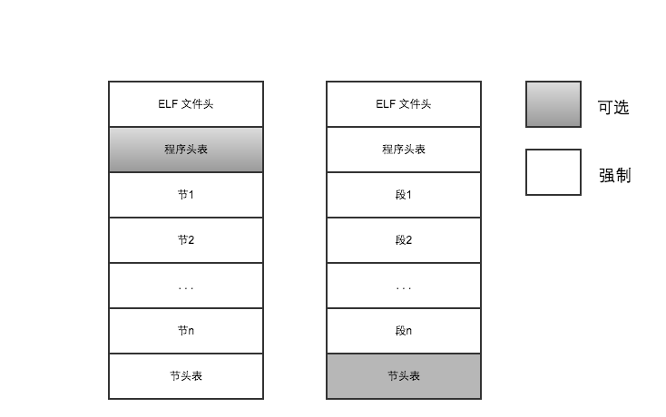

# ELF 文件格式
ELF(executable and linkable format)是一种***可执行文件***，***目标文件***和***库***使用的文件格式,已经称为linux下的标准，取代了a.out格式。特点是统一文件格式能够用于内核支持的几乎所有体系结构上。但是需要注意以下几点：
* 文件格式相同不意味着在不同操作系统类型中存在二进制兼容性。
* 同一个文件在不同的体系结构(即使操作系统相同)上面不能兼容。

不仅用户空间程序和库使用ELF,模块和内核本身也是ELF格式。

## ELF文件的布局和结构
由于链接对象和可执行文件的ELF格式有区别。

* ELF文件头包含表示elf文件的字符串，还包含文件类型以及大小的相关信息，以及文件加载后程序执行的入口点信息。
* 程序头表向系统提供可执行文件的数据在进程种虚拟地址空间的组织方式的相关信息，还表示了文件可能包含的段的数目，以及段的位置和用途。
* 段保存了与文件相关的各种形式的数据，例如符号表，实际的二进制代码，固定值（字符串以及数值常数）
* 节头表包含与各段相关的附加信息

   
我们将用readelf工具来分析这两种elf格式的。

下面是一个程序例子：

    #include <stdio.h>
    
    int add(int a, int b)
    {
        int sum = a + b;
       
        return sum;
    }
    
    
    int fibonacci(int n)
    {
        if (n == 1 || n == 2) {
            return 1;
        } else {
            return fibonacci(n - 1) + fibonacci(n - 2);
        }
    }
    
    
    int main(int argc, char *argv[])
    {
        int a = 1, b = 2, sum, fib;
        
        sum = add(a, b);
        fib = fibonacci(3);
        printf("%d + %d = %d, fibonacci(%d) = %d\n", a, b, sum, 3, fib);
    
        return 0;
    }
    
我们编译成目标文件和可执行程程序
    
    -bash-4.1$ gcc -c test.c -o test.o
    -bash-4.1$ gcc test.c -o test
    
    -bash-4.1$ file test.o
	test.o: ELF 64-bit LSB relocatable, x86-64, version 1 (SYSV), not stripped
    -bash-4.1$ file test
    test: ELF 64-bit LSB executable, x86-64, version 1 (SYSV), dynamically linked (uses shared libs), for GNU/Linux 2.6.18, not stripped

### ELF 文件头

我们先看test.o的elf文件头。

	-bash-4.1$ readelf -h test.o
	ELF Header:
	  Magic:   7f 45 4c 46 02 01 01 00 00 00 00 00 00 00 00 00 
	  Class:                             ELF64
	  Data:                              2's complement, little endian
	  Version:                           1 (current)
	  OS/ABI:                            UNIX - System V
	  ABI Version:                       0
	  Type:                              REL (Relocatable file)
	  Machine:                           Advanced Micro Devices X86-64
	  Version:                           0x1
	  Entry point address:               0x0
	  Start of program headers:          0 (bytes into file)
	  Start of section headers:          592 (bytes into file)
	  Flags:                             0x0
	  Size of this header:               64 (bytes)
	  Size of program headers:           0 (bytes)
	  Number of program headers:         0
	  Size of section headers:           64 (bytes)
	  Number of section headers:         13
	  Section header string table index: 10

test可执行文件的文件头

	-bash-4.1$ readelf -h test
	ELF Header:
	  Magic:   7f 45 4c 46 02 01 01 00 00 00 00 00 00 00 00 00 
	  Class:                             ELF64
	  Data:                              2's complement, little endian
	  Version:                           1 (current)
	  OS/ABI:                            UNIX - System V
	  ABI Version:                       0
	  Type:                              EXEC (Executable file)
	  Machine:                           Advanced Micro Devices X86-64
	  Version:                           0x1
	  Entry point address:               0x4003e0
	  Start of program headers:          64 (bytes into file)
	  Start of section headers:          2816 (bytes into file)
	  Flags:                             0x0
	  Size of this header:               64 (bytes)
	  Size of program headers:           56 (bytes)
	  Number of program headers:         8
	  Size of section headers:           64 (bytes)
	  Number of section headers:         30
	  Section header string table index: 27

文件头种字段含义如下：
* magic 字段存储了16字节的魔数。在开始的7f后面45 4c 46表示了ASCII码E,L,F字符。接下来02表示了是64位模式。
* class 定义了elf类别，有ELF32， ELF64两种
* machine 定义了CPU的相关信息
* type则定义了elf文件类型
* 文件头大小
* 程序头大小,对于目标文件，程序头是可选的，所以对于test.o的为0，而对于test为56
* 文件在虚拟内存中的入口点。这是程序在已经加载并映射到内存中之后，执行开始的位置

也可以使用objdump 来查看文件头

    -bash-4.1$ objdump -f test
    
    test:     file format elf64-x86-64
    architecture: i386:x86-64, flags 0x00000112:
    EXEC_P, HAS_SYMS, D_PAGED
    start address 0x00000000004003e0
    
    -bash-4.1$ objdump -f test.o
    
    test.o:     file format elf64-x86-64
    architecture: i386:x86-64, flags 0x00000011:
    HAS_RELOC, HAS_SYMS
    start address 0x0000000000000000

下面是一些和机器相关的字段,可以从/include/linux/elf-em.h种获取如下机器类型。

machine type | machine code  | machine type | machine code |
------------ | ------------- | ------------ | ------------ |
M32          | 1             | SPARC        |     2        |
M386         | 3             | 68K          |     4        |
88K          | 5             | 486          |     6        |
860          | 7             | MIPS         |     8        |
MIPS_RS3_LE  | 10            | MIPS_RS4_BE  |    10        |
PARISC       | 15            | SPARC32PLUS  |    18        |
PPC          | 20            | PPC64        |    21        |
SPU          | 23            | SPARCV9      |    43        |
SH           | 42            | S390         |    22        |
CRIS         | 76            | H8_300       |    46        |
V850         | 87            | BLACKFIN     |    106       |
M32R         | 88            | FRV          |   0x5441     |
AVR32        | 0x18ad        | ALPHA        |   0x9026     |
M32R         | 88            | FRV          |   0x5441     |

下面是文件用hexdump出来的结果

	-bash-4.1$ hexdump -C test.o
	00000000  7f 45 4c 46 02 01 01 00  00 00 00 00 00 00 00 00  |.ELF............|
	00000010  01 00 3e 00 01 00 00 00  00 00 00 00 00 00 00 00  |..>.............|
	00000020  00 00 00 00 00 00 00 00  50 02 00 00 00 00 00 00  |........P.......|
	00000030  00 00 00 00 40 00 00 00  00 00 40 00 0d 00 0a 00  |....@.....@.....|
	00000040  55 48 89 e5 89 7d ec 89  75 e8 8b 45 e8 8b 55 ec  |UH...}..u..E..U.|
	00000050  8d 04 02 89 45 fc 8b 45  fc c9 c3 55 48 89 e5 53  |....E..E...UH..S|
	00000060  48 83 ec 18 89 7d ec 83  7d ec 01 74 06 83 7d ec  |H....}..}..t..}.|
	00000070  02 75 07 b8 01 00 00 00  eb 1f 8b 45 ec 83 e8 01  |.u.........E....|
	00000080  89 c7 e8 00 00 00 00 89  c3 8b 45 ec 83 e8 02 89  |..........E.....|
	00000090  c7 e8 00 00 00 00 8d 04  03 48 83 c4 18 5b c9 c3  |.........H...[..|
	000000a0  55 48 89 e5 53 48 83 ec  28 89 7d dc 48 89 75 d0  |UH..SH..(.}.H.u.|
	000000b0  c7 45 e0 01 00 00 00 c7  45 e4 02 00 00 00 8b 55  |.E......E......U|
	000000c0  e4 8b 45 e0 89 d6 89 c7  e8 00 00 00 00 89 45 e8  |..E...........E.|
	000000d0  bf 03 00 00 00 e8 00 00  00 00 89 45 ec b8 00 00  |...........E....|
	000000e0  00 00 8b 75 ec 8b 4d e8  8b 55 e4 8b 5d e0 41 89  |...u..M..U..].A.|
	000000f0  f1 41 b8 03 00 00 00 89  de 48 89 c7 b8 00 00 00  |.A.......H......|
	00000100  00 e8 00 00 00 00 b8 00  00 00 00 48 83 c4 28 5b  |...........H..([|
	00000110  c9 c3 00 00 00 00 00 00  25 64 20 2b 20 25 64 20  |........%d + %d |
	00000120  3d 20 25 64 2c 20 66 69  6e 6f 61 63 63 69 28 25  |= %d, finoacci(%|
	00000130  64 29 20 3d 20 25 64 00  00 47 43 43 3a 20 28 47  |d) = %d..GCC: (G|
	00000140  4e 55 29 20 34 2e 34 2e  37 20 32 30 31 32 30 33  |NU) 4.4.7 201203|
	00000150  31 33 20 28 52 65 64 20  48 61 74 20 34 2e 34 2e  |13 (Red Hat 4.4.|
	00000160  37 2d 33 29 00 00 00 00  14 00 00 00 00 00 00 00  |7-3)............|
	00000170  01 7a 52 00 01 78 10 01  1b 0c 07 08 90 01 00 00  |.zR..x..........|
	00000180  1c 00 00 00 1c 00 00 00  00 00 00 00 1b 00 00 00  |................|
	00000190  00 41 0e 10 86 02 43 0d  06 56 0c 07 08 00 00 00  |.A....C..V......|
	000001a0  1c 00 00 00 3c 00 00 00  00 00 00 00 45 00 00 00  |....<.......E...|
	000001b0  00 41 0e 10 86 02 43 0d  06 4e 83 03 72 0c 07 08  |.A....C..N..r...|
	000001c0  24 00 00 00 5c 00 00 00  00 00 00 00 72 00 00 00  |$...\.......r...|
	000001d0  00 41 0e 10 86 02 43 0d  06 64 83 03 02 49 0c 07  |.A....C..d...I..|
	000001e0  08 00 00 00 00 00 00 00  00 2e 73 79 6d 74 61 62  |..........symtab|
	000001f0  00 2e 73 74 72 74 61 62  00 2e 73 68 73 74 72 74  |..strtab..shstrt|
	00000200  61 62 00 2e 72 65 6c 61  2e 74 65 78 74 00 2e 64  |ab..rela.text..d|
	00000210  61 74 61 00 2e 62 73 73  00 2e 72 6f 64 61 74 61  |ata..bss..rodata|
	00000220  00 2e 63 6f 6d 6d 65 6e  74 00 2e 6e 6f 74 65 2e  |..comment..note.|
	00000230  47 4e 55 2d 73 74 61 63  6b 00 2e 72 65 6c 61 2e  |GNU-stack..rela.|
	00000240  65 68 5f 66 72 61 6d 65  00 00 00 00 00 00 00 00  |eh_frame........|
	00000250  00 00 00 00 00 00 00 00  00 00 00 00 00 00 00 00  |................|
	*
	00000290  20 00 00 00 01 00 00 00  06 00 00 00 00 00 00 00  | ...............|
	000002a0  00 00 00 00 00 00 00 00  40 00 00 00 00 00 00 00  |........@.......|
	000002b0  d2 00 00 00 00 00 00 00  00 00 00 00 00 00 00 00  |................|
	000002c0  04 00 00 00 00 00 00 00  00 00 00 00 00 00 00 00  |................|
	000002d0  1b 00 00 00 04 00 00 00  00 00 00 00 00 00 00 00  |................|
	000002e0  00 00 00 00 00 00 00 00  f0 06 00 00 00 00 00 00  |................|
	000002f0  90 00 00 00 00 00 00 00  0b 00 00 00 01 00 00 00  |................|
	00000300  08 00 00 00 00 00 00 00  18 00 00 00 00 00 00 00  |................|
	00000310  26 00 00 00 01 00 00 00  03 00 00 00 00 00 00 00  |&...............|
	00000320  00 00 00 00 00 00 00 00  14 01 00 00 00 00 00 00  |................|
	00000330  00 00 00 00 00 00 00 00  00 00 00 00 00 00 00 00  |................|
	00000340  04 00 00 00 00 00 00 00  00 00 00 00 00 00 00 00  |................|
	00000350  2c 00 00 00 08 00 00 00  03 00 00 00 00 00 00 00  |,...............|
	00000360  00 00 00 00 00 00 00 00  14 01 00 00 00 00 00 00  |................|
	00000370  00 00 00 00 00 00 00 00  00 00 00 00 00 00 00 00  |................|
	00000380  04 00 00 00 00 00 00 00  00 00 00 00 00 00 00 00  |................|
	00000390  31 00 00 00 01 00 00 00  02 00 00 00 00 00 00 00  |1...............|
	000003a0  00 00 00 00 00 00 00 00  18 01 00 00 00 00 00 00  |................|
	000003b0  20 00 00 00 00 00 00 00  00 00 00 00 00 00 00 00  | ...............|
	000003c0  08 00 00 00 00 00 00 00  00 00 00 00 00 00 00 00  |................|
	000003d0  39 00 00 00 01 00 00 00  30 00 00 00 00 00 00 00  |9.......0.......|
	000003e0  00 00 00 00 00 00 00 00  38 01 00 00 00 00 00 00  |........8.......|
	000003f0  2d 00 00 00 00 00 00 00  00 00 00 00 00 00 00 00  |-...............|
	00000400  01 00 00 00 00 00 00 00  01 00 00 00 00 00 00 00  |................|
	00000410  42 00 00 00 01 00 00 00  00 00 00 00 00 00 00 00  |B...............|
	00000420  00 00 00 00 00 00 00 00  65 01 00 00 00 00 00 00  |........e.......|
	00000430  00 00 00 00 00 00 00 00  00 00 00 00 00 00 00 00  |................|
	00000440  01 00 00 00 00 00 00 00  00 00 00 00 00 00 00 00  |................|
	00000450  57 00 00 00 01 00 00 00  02 00 00 00 00 00 00 00  |W...............|
	00000460  00 00 00 00 00 00 00 00  68 01 00 00 00 00 00 00  |........h.......|
	00000470  80 00 00 00 00 00 00 00  00 00 00 00 00 00 00 00  |................|
	00000480  08 00 00 00 00 00 00 00  00 00 00 00 00 00 00 00  |................|
	00000490  52 00 00 00 04 00 00 00  00 00 00 00 00 00 00 00  |R...............|
	000004a0  00 00 00 00 00 00 00 00  80 07 00 00 00 00 00 00  |................|
	000004b0  48 00 00 00 00 00 00 00  0b 00 00 00 08 00 00 00  |H...............|
	000004c0  08 00 00 00 00 00 00 00  18 00 00 00 00 00 00 00  |................|
	000004d0  11 00 00 00 03 00 00 00  00 00 00 00 00 00 00 00  |................|
	000004e0  00 00 00 00 00 00 00 00  e8 01 00 00 00 00 00 00  |................|
	000004f0  61 00 00 00 00 00 00 00  00 00 00 00 00 00 00 00  |a...............|
	00000500  01 00 00 00 00 00 00 00  00 00 00 00 00 00 00 00  |................|
	00000510  01 00 00 00 02 00 00 00  00 00 00 00 00 00 00 00  |................|
	00000520  00 00 00 00 00 00 00 00  90 05 00 00 00 00 00 00  |................|
	00000530  38 01 00 00 00 00 00 00  0c 00 00 00 09 00 00 00  |8...............|
	00000540  08 00 00 00 00 00 00 00  18 00 00 00 00 00 00 00  |................|
	00000550  09 00 00 00 03 00 00 00  00 00 00 00 00 00 00 00  |................|
	00000560  00 00 00 00 00 00 00 00  c8 06 00 00 00 00 00 00  |................|
	00000570  22 00 00 00 00 00 00 00  00 00 00 00 00 00 00 00  |"...............|
	00000580  01 00 00 00 00 00 00 00  00 00 00 00 00 00 00 00  |................|
	00000590  00 00 00 00 00 00 00 00  00 00 00 00 00 00 00 00  |................|
	000005a0  00 00 00 00 00 00 00 00  01 00 00 00 04 00 f1 ff  |................|
	000005b0  00 00 00 00 00 00 00 00  00 00 00 00 00 00 00 00  |................|
	000005c0  00 00 00 00 03 00 01 00  00 00 00 00 00 00 00 00  |................|
	000005d0  00 00 00 00 00 00 00 00  00 00 00 00 03 00 03 00  |................|
	000005e0  00 00 00 00 00 00 00 00  00 00 00 00 00 00 00 00  |................|
	000005f0  00 00 00 00 03 00 04 00  00 00 00 00 00 00 00 00  |................|
	00000600  00 00 00 00 00 00 00 00  00 00 00 00 03 00 05 00  |................|
	00000610  00 00 00 00 00 00 00 00  00 00 00 00 00 00 00 00  |................|
	00000620  00 00 00 00 03 00 07 00  00 00 00 00 00 00 00 00  |................|
	00000630  00 00 00 00 00 00 00 00  00 00 00 00 03 00 08 00  |................|
	00000640  00 00 00 00 00 00 00 00  00 00 00 00 00 00 00 00  |................|
	00000650  00 00 00 00 03 00 06 00  00 00 00 00 00 00 00 00  |................|
	00000660  00 00 00 00 00 00 00 00  08 00 00 00 12 00 01 00  |................|
	00000670  00 00 00 00 00 00 00 00  1b 00 00 00 00 00 00 00  |................|
	00000680  0c 00 00 00 12 00 01 00  1b 00 00 00 00 00 00 00  |................|
	00000690  45 00 00 00 00 00 00 00  16 00 00 00 12 00 01 00  |E...............|
	000006a0  60 00 00 00 00 00 00 00  72 00 00 00 00 00 00 00  |`.......r.......|
	000006b0  1b 00 00 00 10 00 00 00  00 00 00 00 00 00 00 00  |................|
	000006c0  00 00 00 00 00 00 00 00  00 74 65 73 74 2e 63 00  |.........test.c.|
	000006d0  61 64 64 00 66 69 62 6f  6e 61 63 63 69 00 6d 61  |add.fibonacci.ma|
	000006e0  69 6e 00 70 72 69 6e 74  66 00 00 00 00 00 00 00  |in.printf.......|
	000006f0  43 00 00 00 00 00 00 00  02 00 00 00 0a 00 00 00  |C...............|
	00000700  fc ff ff ff ff ff ff ff  52 00 00 00 00 00 00 00  |........R.......|
	00000710  02 00 00 00 0a 00 00 00  fc ff ff ff ff ff ff ff  |................|
	00000720  89 00 00 00 00 00 00 00  02 00 00 00 09 00 00 00  |................|
	00000730  fc ff ff ff ff ff ff ff  96 00 00 00 00 00 00 00  |................|
	00000740  02 00 00 00 0a 00 00 00  fc ff ff ff ff ff ff ff  |................|
	00000750  9e 00 00 00 00 00 00 00  0a 00 00 00 05 00 00 00  |................|
	00000760  00 00 00 00 00 00 00 00  c2 00 00 00 00 00 00 00  |................|
	00000770  02 00 00 00 0c 00 00 00  fc ff ff ff ff ff ff ff  |................|
	00000780  20 00 00 00 00 00 00 00  02 00 00 00 02 00 00 00  | ...............|
	00000790  00 00 00 00 00 00 00 00  40 00 00 00 00 00 00 00  |........@.......|
	000007a0  02 00 00 00 02 00 00 00  1b 00 00 00 00 00 00 00  |................|
	000007b0  60 00 00 00 00 00 00 00  02 00 00 00 02 00 00 00  |`...............|
	000007c0  60 00 00 00 00 00 00 00                           |`.......|
	000007c8

我们发现文件大小为1992字节：

    -bash-4.1$ ls -l test.o
    -rw-r--r-- 1 mqchen users 1992 Nov 15 02:33 test.o
    -bash-4.1$ echo "ibase=10;obase=16;1992" | bc
    7C8

对于ELF的定义有32位和64位两种，我们以64位为例(大小为64字节)。

    // include/linux/elf.h
    typedef struct elf64_hdr {
      unsigned char	e_ident[16];		/* ELF "magic number" */
      Elf64_Half e_type;
      Elf64_Half e_machine;
      Elf64_Word e_version;
      Elf64_Addr e_entry;		/* Entry point virtual address */
      Elf64_Off e_phoff;		/* Program header table file offset */
      Elf64_Off e_shoff;		/* Section header table file offset */
      Elf64_Word e_flags;
      Elf64_Half e_ehsize;
      Elf64_Half e_phentsize;
      Elf64_Half e_phnum;
      Elf64_Half e_shentsize;
      Elf64_Half e_shnum;
      Elf64_Half e_shstrndx;
    } Elf64_Ehdr;

对于test.o目标文件，我们发现文件头如下：

	00000000  7f 45 4c 46 02 01 01 00  00 00 00 00 00 00 00 00  |.ELF............|
	00000010  01 00 3e 00 01 00 00 00  00 00 00 00 00 00 00 00  |..>.............|
	00000020  00 00 00 00 00 00 00 00  50 02 00 00 00 00 00 00  |........P.......|
	00000030  00 00 00 00 40 00 00 00  00 00 40 00 0d 00 0a 00  |....@.....@.....|

* e_type 为1 表示为重定位文件
* e_machine 为0x3e(62)，机器类型为AMD x86-64
* e_version 为1,表示current
* e_entry 为0，因为是重定位文件
* e_phoff 为0，没有程序头表文件
* e_shoff 为0x0250
* e_shnum 为13表示有13个节
* e_shstrndx 为10，表示节名字符串表的节索引为10
* e_phentsize 为0x0040，为64

### ELf 程序头

由于目标文件没有程序头，我们以可执行程序为例。

	-bash-4.1$ readelf -l test.o
	
	There are no program headers in this file.
	-bash-4.1$ readelf -l test
	
	Elf file type is EXEC (Executable file)
	Entry point 0x4003e0
	There are 8 program headers, starting at offset 64
	
	Program Headers:
	  Type           Offset             VirtAddr           PhysAddr
	                 FileSiz            MemSiz              Flags  Align
	  PHDR           0x0000000000000040 0x0000000000400040 0x0000000000400040
	                 0x00000000000001c0 0x00000000000001c0  R E    8
	  INTERP         0x0000000000000200 0x0000000000400200 0x0000000000400200
	                 0x000000000000001c 0x000000000000001c  R      1
	      [Requesting program interpreter: /lib64/ld-linux-x86-64.so.2]
	  LOAD           0x0000000000000000 0x0000000000400000 0x0000000000400000
	                 0x00000000000007b4 0x00000000000007b4  R E    200000
	  LOAD           0x00000000000007b8 0x00000000006007b8 0x00000000006007b8
	                 0x00000000000001ec 0x0000000000000200  RW     200000
	  DYNAMIC        0x00000000000007e0 0x00000000006007e0 0x00000000006007e0
	                 0x0000000000000190 0x0000000000000190  RW     8
	  NOTE           0x000000000000021c 0x000000000040021c 0x000000000040021c
	                 0x0000000000000044 0x0000000000000044  R      4
	  GNU_EH_FRAME   0x00000000000006b8 0x00000000004006b8 0x00000000004006b8
	                 0x0000000000000034 0x0000000000000034  R      4
	  GNU_STACK      0x0000000000000000 0x0000000000000000 0x0000000000000000
	                 0x0000000000000000 0x0000000000000000  RW     8
	
	 Section to Segment mapping:
	  Segment Sections...
	   00     
	   01     .interp 
	   02     .interp .note.ABI-tag .note.gnu.build-id .gnu.hash .dynsym .dynstr .gnu.version .gnu.version_r .rela.dyn .rela.plt .init .plt .text .fini .rodata .eh_frame_hdr .eh_frame 
	   03     .ctors .dtors .jcr .dynamic .got .got.plt .data .bss 
	   04     .dynamic 
	   05     .note.ABI-tag .note.gnu.build-id 
	   06     .eh_frame_hdr 
	   07     
	
	
	
程序头表中的每个程序头对应一个段。 上面有8个程序头，对应8个程序段。这些段组成了最终在内存中执行的程序。程序表头提供了各段在虚拟地址空间和物理地址空间的大小，位置，标志，访问授权和对齐方面的信息。还指定了一个类型，用来描述更精确地描述段。总共有5种类型。
* PHDR 保存程序表头
* INTERP 指定在程序已经从可执行文件映射之后，必须调用的解释器。主要用来解决未解决应用。通常是/lib64/ld-linux-x86-64.so.2 或者/lib/ld-linux.so.2用于在虚拟地址空间种插入程序运行所需的动态库。
* LOAD 表示需要从二进制文件映射到虚拟地址空间的段。主要包含常量数据，字符串，目标代码。
* DYNAMIC 保存了动态链接器使用的信息
* NOTE 保存了专有信息 	

还有一些其他的段，

* SHLIB (shared library) 
* TLS   Thread local storage segment */
* LOOS    0x60000000      /* OS-specific */
* HIOS    0x6fffffff      /* OS-specific */
* LOPROC  0x70000000
* HIPROC  0x7fffffff
* GNU_EH_FRAME  0x6474e550
* GNU_STACK (LOOS + 0x474e551)

下面为程序头数据结构(大小为56字节):

    // include/linux/elf.h
	typedef struct elf64_phdr { 
	  Elf64_Word p_type; 
	  Elf64_Word p_flags; 
	  Elf64_Off p_offset;       /* Segment file offset */ 
	  Elf64_Addr p_vaddr;       /* Segment virtual address */ 
	  Elf64_Addr p_paddr;       /* Segment physical address */ 
	  Elf64_Xword p_filesz;     /* Segment size in file */ 
	  Elf64_Xword p_memsz;      /* Segment size in memory */ 
	  Elf64_Xword p_align;      /* Segment alignment, file & memory */ 
	} Elf64_Phdr; 

### 节

上面的程序头表中指定了那些节映射到那些段的信息。有一个节头表来管理文件中的各个节。

在上面的可执行文件test中有8个段，共30个节。

	 Section to Segment mapping:
	  Segment Sections...
	   00     
	   01     .interp 
	   02     .interp .note.ABI-tag .note.gnu.build-id .gnu.hash .dynsym .dynstr .gnu.version .gnu.version_r .rela.dyn .rela.plt .init .plt .text .fini .rodata .eh_frame_hdr .eh_frame 
	   03     .ctors .dtors .jcr .dynamic .got .got.plt .data .bss 
	   04     .dynamic 
	   05     .note.ABI-tag .note.gnu.build-id 
	   06     .eh_frame_hdr 
	   07     

比如第二个段，对应的节为.interp 

下面为节头表数据结构(大小64字节)

    // include/linux/elf.h
	typedef struct elf64_shdr {
	  Elf64_Word sh_name;       /* Section name, index in string tbl */
	  Elf64_Word sh_type;       /* Type of section */
	  Elf64_Xword sh_flags;     /* Miscellaneous section attributes */
	  Elf64_Addr sh_addr;       /* Section virtual addr at execution */
	  Elf64_Off sh_offset;      /* Section file offset */
	  Elf64_Xword sh_size;      /* Size of section in bytes */
	  Elf64_Word sh_link;       /* Index of another section */
	  Elf64_Word sh_info;       /* Additional section information */
	  Elf64_Xword sh_addralign; /* Section alignment */
	  Elf64_Xword sh_entsize;   /* Entry size if section holds table */
	} Elf64_Shdr;

elf 标准定义了若干固定的节，所有的名称都以.开始，以便与用户定义节或非标准节区分。最重要的标准节如下。

* .bss 保存程序未初始化的数据节，在程序开始前填充0字节。
* .data 包含已经初始化的程序数据
* .rodata 包存程序使用的只读数据，不能修改，比如字符串。
* .dynamic 和.dynstr 保存了动态信息
* .shstrtab 包含了一个字符串表，定义了节名称。
* .strtab 保存了一个字符串符号表
* .symtab 保存了二进制文件的符号表
* .init 和 .fini保存了程序初始化和结束时执行的机器指令,这两个节的内容通常由编译器及其辅助工具自动创建，主要为程序建立一个适当的运行时环境。比如C＋＋中的全局变量或者静态变量的析构都会.fini中执行。如果进程调用了_exit或者由于未捕捉的信号退出时不会执行atexit。 
* .text 保存了主要的机器指令

通过前面的elf header信息我们可以知道test.o有13个Section. 下面是详细信息。

	-bash-4.1$ readelf -S test.o
	There are 13 section headers, starting at offset 0x250:
	
	Section Headers:
	  [Nr] Name              Type             Address           Offset
	       Size              EntSize          Flags  Link  Info  Align
	  [ 0]                   NULL             0000000000000000  00000000
	       0000000000000000  0000000000000000           0     0     0
	  [ 1] .text             PROGBITS         0000000000000000  00000040
	       00000000000000d2  0000000000000000  AX       0     0     4
	  [ 2] .rela.text        RELA             0000000000000000  000006f0
	       0000000000000090  0000000000000018          11     1     8
	  [ 3] .data             PROGBITS         0000000000000000  00000114
	       0000000000000000  0000000000000000  WA       0     0     4
	  [ 4] .bss              NOBITS           0000000000000000  00000114
	       0000000000000000  0000000000000000  WA       0     0     4
	  [ 5] .rodata           PROGBITS         0000000000000000  00000118
	       0000000000000020  0000000000000000   A       0     0     8
	  [ 6] .comment          PROGBITS         0000000000000000  00000138
	       000000000000002d  0000000000000001  MS       0     0     1
	  [ 7] .note.GNU-stack   PROGBITS         0000000000000000  00000165
	       0000000000000000  0000000000000000           0     0     1
	  [ 8] .eh_frame         PROGBITS         0000000000000000  00000168
	       0000000000000080  0000000000000000   A       0     0     8
	  [ 9] .rela.eh_frame    RELA             0000000000000000  00000780
	       0000000000000048  0000000000000018          11     8     8
	  [10] .shstrtab         STRTAB           0000000000000000  000001e8
	       0000000000000061  0000000000000000           0     0     1
	  [11] .symtab           SYMTAB           0000000000000000  00000590
	       0000000000000138  0000000000000018          12     9     8
	  [12] .strtab           STRTAB           0000000000000000  000006c8
	       0000000000000022  0000000000000000           0     0     1
	Key to Flags:
	  W (write), A (alloc), X (execute), M (merge), S (strings)
	  I (info), L (link order), G (group), x (unknown)
	  O (extra OS processing required) o (OS specific), p (processor specific)
### 字符串表

字符串在elf中的存储结构如下

0  | 1  | 2 | 3 | 4 | 5 | 6 | 7 | 8 | 9 |
---| ---|---|---|---|---|---|---|---|---|
\0 | a  | d | d | \0| m | a | i | n | \0|

表的第一个字节是0，后续各个字符串通过0字节分隔。引用字符串的方法就是指定一个索引，将选中到下一个\0之前的所有字符。.strtab不是efl文件中唯一的字符串表。.shstrtab用于存放文件中各个节的文本名称。

下面是通过readelf读出来的.strtab 和.shstrtab。

	-bash-4.1$ readelf --string-dump=.strtab test.o
	
	String dump of section '.strtab':
	  [     1]  test.c
	  [     8]  add
	  [     c]  fibonacci
	  [    16]  main
	  [    1b]  printf

	-bash-4.1$ readelf --string-dump=.shstrtab test.o
	
	String dump of section '.shstrtab':
	  [     1]  .symtab
	  [     9]  .strtab
	  [    11]  .shstrtab
	  [    1b]  .rela.text
	  [    26]  .data
	  [    2c]  .bss
	  [    31]  .rodata
	  [    39]  .comment
	  [    42]  .note.GNU-stack
	  [    52]  .rela.eh_frame

### 符号表(.symtab)

符号表是每个elf文件中的重要部分，因为它保存了程序中所有的全局变量和函数。如果程序引用了一个自身代码未定义的符号，则称为未定义符号.
使用nm工具可以生成程序定义和使用的所有符号列表。

	-bash-4.1$ nm test.o
	0000000000000000 T add
	000000000000001b T fibonacci
	0000000000000060 T main
	                 U printf
	-bash-4.1$ nm test
	00000000006007e0 d _DYNAMIC
	0000000000600978 d _GLOBAL_OFFSET_TABLE_
	0000000000400688 R _IO_stdin_used
	                 w _Jv_RegisterClasses
	00000000006007c0 d __CTOR_END__
	00000000006007b8 d __CTOR_LIST__
	00000000006007d0 D __DTOR_END__
	00000000006007c8 d __DTOR_LIST__
	00000000004007b0 r __FRAME_END__
	00000000006007d8 d __JCR_END__
	00000000006007d8 d __JCR_LIST__
	00000000006009a4 A __bss_start
	00000000006009a0 D __data_start
	0000000000400640 t __do_global_ctors_aux
	0000000000400430 t __do_global_dtors_aux
	0000000000400690 R __dso_handle
	                 w __gmon_start__
	00000000006007b4 d __init_array_end
	00000000006007b4 d __init_array_start
	00000000004005a0 T __libc_csu_fini
	00000000004005b0 T __libc_csu_init
	                 U __libc_start_main@@GLIBC_2.2.5
	00000000006009a4 A _edata
	00000000006009b8 A _end
	0000000000400678 T _fini
	0000000000400390 T _init
	00000000004003e0 T _start
	00000000004004c4 T add
	000000000040040c t call_gmon_start
	00000000006009a8 b completed.6349
	00000000006009a0 W data_start
	00000000006009b0 b dtor_idx.6351
	00000000004004df T fibonacci
	00000000004004a0 t frame_dummy
	0000000000400524 T main
	                 U printf@@GLIBC_2.2.5

U表示未定义符号。在可执行文件中，printf 虽然是未定义的，但是增加了一些信息，表明能够提供函数的GNU标准库的最低版本。程序本省定义的add和main符号已经移到虚拟地址空间中固定位置。在文件加载时，对应的代码将映射到这些位置。

ELF 使用3个表来实现符号表。
* .symtab 确定符号的名称和值的关联。符号不是以字符串形式出现的，而是某个字符串数组的索引。
* .strtab
* .hash 保存了一个散列表，帮助快速查找符号。

下面时符号表的数据结构

    // include/linux/elf.h
	typedef struct elf64_sym {
	  Elf64_Word st_name;       /* Symbol name, index in string tbl */
	  unsigned char st_info;    /* Type and binding attributes */
	  unsigned char st_other;   /* No defined meaning, 0 */
	  Elf64_Half st_shndx;      /* Associated section index */
	  Elf64_Addr st_value;      /* Value of the symbol */
	  Elf64_Xword st_size;      /* Associated symbol size */
	} Elf64_Sym;

    // symbol type
	#define STB_LOCAL  0 
	#define STB_GLOBAL 1 
	#define STB_WEAK   2 

	#define STT_NOTYPE  0
	#define STT_OBJECT  1
	#define STT_FUNC    2
	#define STT_SECTION 3
	#define STT_FILE    4
	#define STT_COMMON  5
	#define STT_TLS     6

下面是符号表中的所有符号：

	-bash-4.1$ readelf -s test.o
	
	Symbol table '.symtab' contains 13 entries:
	   Num:    Value          Size Type    Bind   Vis      Ndx Name
	     0: 0000000000000000     0 NOTYPE  LOCAL  DEFAULT  UND 
	     1: 0000000000000000     0 FILE    LOCAL  DEFAULT  ABS test.c
	     2: 0000000000000000     0 SECTION LOCAL  DEFAULT    1 
	     3: 0000000000000000     0 SECTION LOCAL  DEFAULT    3 
	     4: 0000000000000000     0 SECTION LOCAL  DEFAULT    4 
	     5: 0000000000000000     0 SECTION LOCAL  DEFAULT    5 
	     6: 0000000000000000     0 SECTION LOCAL  DEFAULT    7 
	     7: 0000000000000000     0 SECTION LOCAL  DEFAULT    8 
	     8: 0000000000000000     0 SECTION LOCAL  DEFAULT    6 
	     9: 0000000000000000    27 FUNC    GLOBAL DEFAULT    1 add
	    10: 000000000000001b    69 FUNC    GLOBAL DEFAULT    1 fibonacci
	    11: 0000000000000060   114 FUNC    GLOBAL DEFAULT    1 main
	    12: 0000000000000000     0 NOTYPE  GLOBAL DEFAULT  UND printf

通过上述，我们可以得出如下结论。
add,fibonacci,main 都在节1中。printf未定义引用，索引为UND，所以类型也为NOTYPE。原文件的名称存储为一个绝对值。 

### 重定位项

重定位是将ELF文件中未定义符号关联到有效值的处理过程。对用户空间程序的符号替换，内核不会涉及其中，因为所有的替换操作都是由外部工具完成的。对与内核模块来说，情况有所不同。

在每个目标文件中，都有一个专门的表，包含了重定位项，标识了需要进行重定位之处。每个表项都包含下列信息。
* 一个偏移量，指定了需要修改的项的位置
* 对符号的引用，提供了需要插入到重定位位置的数据

	Relocation section '.rela.text' at offset 0x6f0 contains 6 entries:
	  Offset          Info           Type           Sym. Value    Sym. Name + Addend
	000000000043  000a00000002 R_X86_64_PC32     000000000000001b fibonacci - 4
	000000000052  000a00000002 R_X86_64_PC32     000000000000001b fibonacci - 4
	000000000089  000900000002 R_X86_64_PC32     0000000000000000 add - 4
	000000000096  000a00000002 R_X86_64_PC32     000000000000001b fibonacci - 4
	00000000009e  00050000000a R_X86_64_32       0000000000000000 .rodata + 0
	0000000000c2  000c00000002 R_X86_64_PC32     0000000000000000 printf - 4
	
	Relocation section '.rela.eh_frame' at offset 0x780 contains 3 entries:
	  Offset          Info           Type           Sym. Value    Sym. Name + Addend
	000000000020  000200000002 R_X86_64_PC32     0000000000000000 .text + 0
	000000000040  000200000002 R_X86_64_PC32     0000000000000000 .text + 1b
	000000000060  000200000002 R_X86_64_PC32     0000000000000000 .text + 60

	typedef struct elf64_rel {
	  Elf64_Addr r_offset;  /* Location at which to apply the action */
	  Elf64_Xword r_info;   /* index and type of relocation */
	} Elf64_Rel;
	
	typedef struct elf64_rela {
	  Elf64_Addr r_offset;  /* Location at which to apply the action */
	  Elf64_Xword r_info;   /* index and type of relocation */
	  Elf64_Sxword r_addend;    /* Constant addend used to compute value */
	} Elf64_Rela;
	

发现上面有两个rel 结构，这是由于技术原因，有两种类型的重定位信息，第一种称为普通重定位。第二种需要添加常数的重定位项。	
虽然ELF标准定义了许多重定位类型，但是linux内核只对模块的重定位感兴趣，因此*绝对重定位* 和 *相对重定位*就够用了。相对重定位生成的重定位表项指向相对于程序计数器(PC)指定的内存地址，这些主要用于子例程调用。另一种重定位生成绝对地址，从名字就能看出来。通常，这种重定位项指向内存中在编译时就已知的数据。
  
在X86_64系统上，重定位类型由常数R_X86_64_PC32(相对重定位) 和 R_X86_64_32(绝对重定位)表示。重定位计算结果如下:

* R_X86_64_PC32 : Result = S - PC + A
* R_X86_64_32 : Result = S + A

其中S 表示符号表中保存的符号的值，而P代表重先定位的位置偏移量，换言之，就是算出的数据写入到二进制文件中的位置偏移量。如果加数值为0，那么绝对重定位就是将符号表中的值插入到重定位位置。但在相对重定位中，需要计算符号位置和重定位位置之间的差值。在这两种情况下，对会加上加数值，因而使结果产生一个线性位移。

在测试文件test.o中包括以下调用语句。

	88:	e8 00 00 00 00       	callq  8d <main+0x2d>

	Relocation section '.rela.text' at offset 0x6f0 contains 6 entries:
	000000000089  000900000002 R_X86_64_PC32     0000000000000000 add - 4

e8 使callq的操作码，而0x00000000是传递给call作为参数的值。使用的加式重定位。二进制文件的节在重定位之前就会移动到其在内存中的位置，add在内存中的位置是已知。从重定位表可以看出，重定位0x89是add的函数调用.

反汇编后代码为：

	-bash-4.1$ objdump -d -M x86-64 test.o 
	
	test.o:     file format elf64-x86-64
	
	
	Disassembly of section .text:
	
	0000000000000000 <add>:
	   0:	55                   	push   %rbp
	   1:	48 89 e5             	mov    %rsp,%rbp
	   4:	89 7d ec             	mov    %edi,-0x14(%rbp)
	   7:	89 75 e8             	mov    %esi,-0x18(%rbp)
	   a:	8b 45 e8             	mov    -0x18(%rbp),%eax
	   d:	8b 55 ec             	mov    -0x14(%rbp),%edx
	  10:	8d 04 02             	lea    (%rdx,%rax,1),%eax
	  13:	89 45 fc             	mov    %eax,-0x4(%rbp)
	  16:	8b 45 fc             	mov    -0x4(%rbp),%eax
	  19:	c9                   	leaveq 
	  1a:	c3                   	retq   
	
	000000000000001b <fibonacci>:
	  1b:	55                   	push   %rbp
	  1c:	48 89 e5             	mov    %rsp,%rbp
	  1f:	53                   	push   %rbx
	  20:	48 83 ec 18          	sub    $0x18,%rsp
	  24:	89 7d ec             	mov    %edi,-0x14(%rbp)
	  27:	83 7d ec 01          	cmpl   $0x1,-0x14(%rbp)
	  2b:	74 06                	je     33 <fibonacci+0x18>
	  2d:	83 7d ec 02          	cmpl   $0x2,-0x14(%rbp)
	  31:	75 07                	jne    3a <fibonacci+0x1f>
	  33:	b8 01 00 00 00       	mov    $0x1,%eax
	  38:	eb 1f                	jmp    59 <fibonacci+0x3e>
	  3a:	8b 45 ec             	mov    -0x14(%rbp),%eax
	  3d:	83 e8 01             	sub    $0x1,%eax
	  40:	89 c7                	mov    %eax,%edi
	  42:	e8 00 00 00 00       	callq  47 <fibonacci+0x2c>
	  47:	89 c3                	mov    %eax,%ebx
	  49:	8b 45 ec             	mov    -0x14(%rbp),%eax
	  4c:	83 e8 02             	sub    $0x2,%eax
	  4f:	89 c7                	mov    %eax,%edi
	  51:	e8 00 00 00 00       	callq  56 <fibonacci+0x3b>
	  56:	8d 04 03             	lea    (%rbx,%rax,1),%eax
	  59:	48 83 c4 18          	add    $0x18,%rsp
	  5d:	5b                   	pop    %rbx
	  5e:	c9                   	leaveq 
	  5f:	c3                   	retq   
	
	0000000000000060 <main>:
	  60:	55                   	push   %rbp
	  61:	48 89 e5             	mov    %rsp,%rbp
	  64:	53                   	push   %rbx
	  65:	48 83 ec 28          	sub    $0x28,%rsp
	  69:	89 7d dc             	mov    %edi,-0x24(%rbp)
	  6c:	48 89 75 d0          	mov    %rsi,-0x30(%rbp)
	  70:	c7 45 e0 01 00 00 00 	movl   $0x1,-0x20(%rbp)
	  77:	c7 45 e4 02 00 00 00 	movl   $0x2,-0x1c(%rbp)
	  7e:	8b 55 e4             	mov    -0x1c(%rbp),%edx
	  81:	8b 45 e0             	mov    -0x20(%rbp),%eax
	  84:	89 d6                	mov    %edx,%esi
	  86:	89 c7                	mov    %eax,%edi
	  88:	e8 00 00 00 00       	callq  8d <main+0x2d>
	  8d:	89 45 e8             	mov    %eax,-0x18(%rbp)
	  90:	bf 03 00 00 00       	mov    $0x3,%edi
	  95:	e8 00 00 00 00       	callq  9a <main+0x3a>
	  9a:	89 45 ec             	mov    %eax,-0x14(%rbp)
	  9d:	b8 00 00 00 00       	mov    $0x0,%eax
	  a2:	8b 75 ec             	mov    -0x14(%rbp),%esi
	  a5:	8b 4d e8             	mov    -0x18(%rbp),%ecx
	  a8:	8b 55 e4             	mov    -0x1c(%rbp),%edx
	  ab:	8b 5d e0             	mov    -0x20(%rbp),%ebx
	  ae:	41 89 f1             	mov    %esi,%r9d
	  b1:	41 b8 03 00 00 00    	mov    $0x3,%r8d
	  b7:	89 de                	mov    %ebx,%esi
	  b9:	48 89 c7             	mov    %rax,%rdi
	  bc:	b8 00 00 00 00       	mov    $0x0,%eax
	  c1:	e8 00 00 00 00       	callq  c6 <main+0x66>
	  c6:	b8 00 00 00 00       	mov    $0x0,%eax
	  cb:	48 83 c4 28          	add    $0x28,%rsp
	  cf:	5b                   	pop    %rbx
	  d0:	c9                   	leaveq 
	  d1:	c3                   	retq   
	
test 函数反编译结果如下：

	0000000000400524 <main>:
	  400524:	55                   	push   %rbp
	  400525:	48 89 e5             	mov    %rsp,%rbp
	  400528:	53                   	push   %rbx
	  400529:	48 83 ec 28          	sub    $0x28,%rsp
	  40052d:	89 7d dc             	mov    %edi,-0x24(%rbp)
	  400530:	48 89 75 d0          	mov    %rsi,-0x30(%rbp)
	  400534:	c7 45 e0 01 00 00 00 	movl   $0x1,-0x20(%rbp)
	  40053b:	c7 45 e4 02 00 00 00 	movl   $0x2,-0x1c(%rbp)
	  400542:	8b 55 e4             	mov    -0x1c(%rbp),%edx
	  400545:	8b 45 e0             	mov    -0x20(%rbp),%eax
	  400548:	89 d6                	mov    %edx,%esi
	  40054a:	89 c7                	mov    %eax,%edi
	  40054c:	e8 73 ff ff ff       	callq  4004c4 <add>
	  400551:	89 45 e8             	mov    %eax,-0x18(%rbp)
	  400554:	bf 03 00 00 00       	mov    $0x3,%edi
	  400559:	e8 81 ff ff ff       	callq  4004df <fibonacci>
	  40055e:	89 45 ec             	mov    %eax,-0x14(%rbp)
	  400561:	b8 98 06 40 00       	mov    $0x400698,%eax
	  400566:	8b 75 ec             	mov    -0x14(%rbp),%esi
	  400569:	8b 4d e8             	mov    -0x18(%rbp),%ecx
	  40056c:	8b 55 e4             	mov    -0x1c(%rbp),%edx
	  40056f:	8b 5d e0             	mov    -0x20(%rbp),%ebx
	  400572:	41 89 f1             	mov    %esi,%r9d
	  400575:	41 b8 03 00 00 00    	mov    $0x3,%r8d
	  40057b:	89 de                	mov    %ebx,%esi
	  40057d:	48 89 c7             	mov    %rax,%rdi
	  400580:	b8 00 00 00 00       	mov    $0x0,%eax
	  400585:	e8 2e fe ff ff       	callq  4003b8 <printf@plt>
	  40058a:	b8 00 00 00 00       	mov    $0x0,%eax
	  40058f:	48 83 c4 28          	add    $0x28,%rsp
	  400593:	5b                   	pop    %rbx
	  400594:	c9                   	leaveq 
	  400595:	c3                   	retq   
	  400596:	90                   	nop
	  400597:	90                   	nop
	  400598:	90                   	nop
	  400599:	90                   	nop
	  40059a:	90                   	nop
	  40059b:	90                   	nop
	  40059c:	90                   	nop
	  40059d:	90                   	nop
	  40059e:	90                   	nop  
	  40059f:	90                   	nop

从上面可以看出，e8 73 ff ff ff 中的73 ff ff ff等于-0x8d,表示当前位置减去0x8d, 可以看出在test.o中

	  88:	e8 00 00 00 00       	callq  8d <main+0x2d>

	  Relocation section '.rela.text' at offset 0x6f0 contains 6 entries:
	  000000000089  000900000002 R_X86_64_PC32     0000000000000000 add - 4

8d 正好是add 函数的位置，因为add - 4 = 0x89，所以add = 0x8d

### 动态链接

内核对必须与库动态链接才能运行的ELF不感兴趣。模块中的所有应用都可以通过重定位解决，用户空间的动态链接则完全由用户空间的ld.so进行。现面两个节保存了动态链接需要的数据。
* .dynsym 保存了有关符号表，包含了所有需要通过外部引用解决的符号。
* .dynamic 保存了一个数组，数组项位ELf64_Dyn类型。

	typedef struct {
	  Elf64_Sxword d_tag;       /* entry tag value */
	  union {
	    Elf64_Xword d_val;
	    Elf64_Addr d_ptr;
	  } d_un;
	} Elf64_Dyn;

* d_tag 用于区分各种指定信息类型的标记，改联合根据标记进行解释。d_un保存一个整数或者一个虚拟地址，根据特定的标记进行解释。

最重要的标记如下：
* DT_NEEDED 指定一个程序需要的动态库。d_un指向一个字符串表项，给出库的名称。
* DT_SYMTAB 保存了符号表的位置
* DT_INIT 和DT_FINI保存了用于初始化和结束程序的函数的地址。
* DT_STRTAB 保存了字符串表的位置。

test可执行程序所需的动态库如下：

	-bash-4.1$ readelf --dynamic test
	
	Dynamic section at offset 0x7e0 contains 20 entries:
	  Tag        Type                         Name/Value
	 0x0000000000000001 (NEEDED)             Shared library: [libc.so.6]
	 0x000000000000000c (INIT)               0x400390
	 0x000000000000000d (FINI)               0x400678
	 0x000000006ffffef5 (GNU_HASH)           0x400260
	 0x0000000000000005 (STRTAB)             0x4002e0
	 0x0000000000000006 (SYMTAB)             0x400280
	 0x000000000000000a (STRSZ)              63 (bytes)
	 0x000000000000000b (SYMENT)             24 (bytes)
	 0x0000000000000015 (DEBUG)              0x0
	 0x0000000000000003 (PLTGOT)             0x600978
	 0x0000000000000002 (PLTRELSZ)           48 (bytes)
	 0x0000000000000014 (PLTREL)             RELA
	 0x0000000000000017 (JMPREL)             0x400360
	 0x0000000000000007 (RELA)               0x400348
	 0x0000000000000008 (RELASZ)             24 (bytes)
	 0x0000000000000009 (RELAENT)            24 (bytes)
	 0x000000006ffffffe (VERNEED)            0x400328
	 0x000000006fffffff (VERNEEDNUM)         1
	 0x000000006ffffff0 (VERSYM)             0x400320
	 0x0000000000000000 (NULL)               0x0
