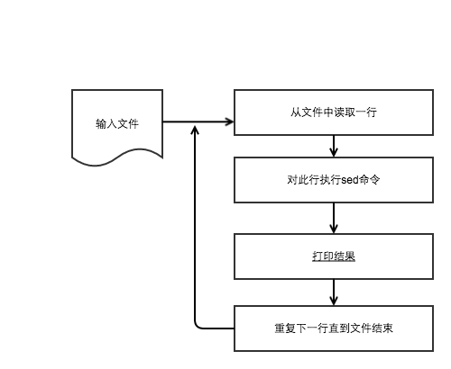

# "sed & awk 101 hacks" 读书笔记 

## sed执行方式
sed有命令行和文件两种执行方式
命令行方式   : 

    sed [options] {sed commands} {input-file}
    sed [options] -e {sed-command-1} -e {sed-command-2} {input-file}
    sed [options] '{ sed-command-1 sed-command-2 }' {input-file}

例子：

    sed -n 'p' /etc/passwd
    sed -n -e '/^root/ p' -e '/^nobody/ p' /etc/passwd    
    sed -n '{ 
        /^root/ p
        /^nobody/ p
    }' /etc/passwd

文件执行方式 :
    
   sed [options] -f {sed-script-file} {input-file}
   sed -n -f test-script.sed /etc/passwd

sed 文件中的注释和bash类似用#

## sed 选项
sed 可以有如下选项。 
1. -E 用现代正则表达式的方式解释正则表达式
2. -a
3. -e command
4. -f command_file
5. -i extension 原地编辑文件，如果没有extension,就没有备份文件。不推荐这样做
6. -n 抑制pattern space的echo 输出
7. -l 缓冲输出行(?)

**注意** -E,-a, -i不是所有操作系统上的sed版本都支持的。

## sed 执行流程

   
## 打印
打印的时候一般要指定－n选项来抑制pattern space的标准输出

### 指定行范围
1. sed 'p' employee.txt         # 每行打印两次
2. sed -n 'p' employee.txt      # 每行打印一次
3. sed -n '2 p' employee.txt    # 打印第2行
4. sed -n '2,4 p' employee.txt  # 打印第2到4行
5. sed -n '2,$ p' employee.txt  # 打印第2行到文件结尾
6. sed -n '2+4 p' employee.txt  # 打印第2行到第5行
7. sed -n '1~2 p' employee.txt  # 打印奇数行

### 模式匹配
1. sed -n '/Jane/ p' employee.txt       # 匹配Jane的行
2. sed -n '/Jane/,$ p' employee.txt     # 匹配Jane到文件结束
3. sed -n '/Jane/,4 p' employee.txt     # 匹配Jane到第4行（如果前面四行没有匹配上，就值打印后面匹配上的）
4. sed -n '/Jane/,/Tim/ p' employee.txt # 匹配Jane以及Tim之间的文本
5. sed -n '/Jane/,+2 p' employee.txt    # 匹配Jane的行以及接下来的两行

## 删除
删除和打印类似，有两个比较有用的删除命令
sed '/^$/ d'  # 删除空行
sed '/^#/ d'  # 删除注释(假设注释以#开头)

## 输出
输出指定范围的行到指定的文件中

1. sed 'w output.txt' employee.txt        # 输出到output.txt
2. sed -n '2 w output.txt' employee.txt   # 输出第2行到output.txt
3. sed -n '2,4 w output.txt' employee.txt # 输出第2行到第4行到output.txt
4. sed -n '2,$ w output.txt' employee.txt # 输出第2行到第4行到output.txt

## 替换
替换是sed最强大的功能。替换命令的格式如下：

    sed '[address-range|pattern-range] s/originalstring/replacement-string/[substitute-flags]' inputfile

1. sed 's/Manager/Director/' employee.txt   # 替换所有的Manager为Director
2. sed '/Sale/s/Manager/Director/' employee.txt #替换匹配Sale的行中的Manager为Director

### 获得匹配的文本(&)

    sed '/^.*$/<&>/g' input-file 

上面这个命令可以给所有的行加上<>

    sed '/[0-9]+/[&]/g' input-file

### 获得匹配的分组\n

    $ sed 's/\(^\|[^0-9.]\)\([0-9]\+\)\([0-9]\{3\}\)/\1\2,\3/g' numbers.txt
    $ sed 's/\([^,]*\),\([^,]*\),\(.*\).*/\2,\1,\3/g' employee.txt

### 替换选项flag 

1. g，替换行中的所有出现模式
2. 数字n，替换第n此出现
3. p,打印替换成功的行，一般和-n选项一起使用
4. w,输出替换成功的行，一般和-n选项一起使用
5. i,忽略大小写
6. e,执行

例子：

    $cat files.txt
    /etc/passwd
    /etc/group
    files.txt的每行前面添加"ls -l"
    $sed 's/^/ls -l /' files.txt
    ls -l /etc/passwd
    ls -l /etc/group
    $sed 's/^/ls -l /e' files.txt
    -rw-r--r-- 1 root root 1547 Oct 27 08:11 /etc/passwd
    -rw-r--r-- 1 root root 651 Oct 27 08:11 /etc/group 
   
7. 上面一些flag可以一起使用

例子：

    $ sed -n 's/Manager/Director/gipw output.txt' employee.txt 

## sed 替换分隔符
在下面这个例子中: $ sed 's/\/usr\/local\/bin/\/usr\/bin/' path.txt,如果分隔符为/，那么需要转义。sed支持使用其他任意字符分隔符。一般推荐使用| or ^ or @ or !.因此上面的例子可以写为:

    $sed 's|/usr/local/bin/|/usr/bin/|' path.txt
    $sed 's^/usr/local/bin/^/usr/bin/^' path.txt
    $sed 's!/usr/local/bin/!/usr/bin/!' path.txt
    $sed 's@/usr/local/bin/@/usr/bin/@' path.txt

## 多个替换命令会对同一行起作用

## 正则表达式
1. 开头^

    $sed -n '/^103/ p' employee.txt

2. 结尾$

    $ sed -n '/r$/ p' employee.txt

3. 单个字符匹配.

    $ sed -n 's/J... /Jason /p' employee.txt

4. 0个或多个字符*

    $sed -n '/log: *./ p' log.txt
   
5. 1个或多个字符\＋

    $ sed -n '/log: \+/ p' log.txt 

6. 0个或1个字符\?

    $ sed -n '/log: \?/ p' log.txt

7. 转义符\

8. 字符集合［］

    $sed -n '/[234]/ p' employee.txt

9. 或操作 \| 

    $ sed -n '/[2-3]\|105/ p' employee.txt

10.  出现次数{}

    $ sed -n '/^[0-9]\{5\}$/ p' numbers.txt
    $ sed -n '/^[0-9]\{3,5\}$/ p' numbers.txt 

11. 单词边界\b

    $sed -n '/\bthe\b/ p' words.txt
    $sed -n '/\bthe/ p' words.txt

12. 向后引用(\n)
    
    $ sed -n '/\(the\)\1/ p' words.txt

## sed 执行方式
sed 文件可以仅仅是命令，也可以以脚本的方式执行。 只需要在文件开头指定解释器即可。

例子：

    #!/bin/sed -f 
    # Swap field 1 (employee id) with field 2 (employee
    name)
    s/\([^,]*\),\([^,]*\),\(.*\).*/\2,\1,\3/g
    # Enclose the whole line within < and >
    s/^.*/<&>/
    # Replace Developer with IT Manager
    49
    Sed and Awk 101 Hacks
    s/Developer/IT Manager/
    # Replace Manager with Director
    s/Manager/Director/
    
    chmod u+x myscript.sed
    ./myscript.sed employee.txt

上面还可以指定#!/bin/sed -nf

## 原地编辑文件

    sed -i bak 's/John/Johnny/' employee.txt
    sed -ibak 's/John/Johnny/' employee.txt
    sed --in-place=bak 's/John/Johnny/' employee.txt

## 其他的sed 命令

### 添加行的命令a
语法:

    $ sed '[address] a the-line-to-append' input-file
    $ sed '2 a 203,Jack Johnson,Engineer' employee.txt

    $ sed '/Jason/a\
    203,Jack Johnson,Engineer\
    204,Mark Smith,Sales Engineer' employee.txt

### 行前插入i

    $ sed '[address] i the-line-to-insert' input-file
    $ sed '2 i 203,Jack Johnson,Engineer' employee.txt

### 替换行 c

    $ sed '[address] c the-line-to-insert' input-file
    $ sed '2 c 202,Jack Johnson,Engineer' employee.txt

### 三者合并使用

    $ sed '/Jason/ {
    a\
    204,Jack Johnson,Engineer
    i\
    202,Mark Smith,Sales Engineer
    c\
    203,Joe Mason,Sysadmin
    }' employee.txt

### 隐藏字符

    打印隐藏字符
    $ sed -n l tabfile.txt
    fname\tFirst Name$
    lname\tLast Name$
    mname\tMiddle Name$

### 打印行号(=)
    
    $ sed -n '$ =' employee.txt

### 改变大小写

    $ sed 'y/abcde/ABCDE/' employee.txt
    $ sed 'y/abcdefghijklmnopqrstuvwxyz/ABCDEFGHIJKLMNOPQRSTUVWXYZ/' employee.txt

### sed 作用在多个文件上

    $sed -n '/^root/ p' /etc/passwd /etc/group

### sed退出命令q

    $sed 'q' employee.txt

### sed读文件r

    $ sed '$ r log.txt' employee.txt
    $ sed '/Raj/ r log.txt' employee.txt

### 作业题
head -n 用sed 表示 
    
    sed -n '1,n p' input-file
    sed 'n q' input-file

grep -v/grep 

    sed -n '/pattern/ !p' input-file

cat 

    sed n input-file 
    sed -n 'p' input-file

